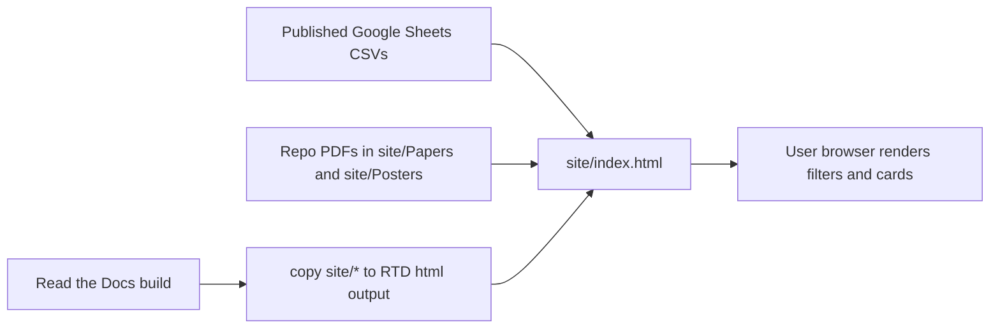

# Symposium Developer README

This repository hosts a fully static project browser for the Academies of Loudoun Research Symposium 2026.

There is no backend, no build step for the site itself, and no generated JavaScript bundle. The production app is a single HTML file at `site/index.html` with inline CSS and inline JavaScript.

## Architecture at a glance



## Where the data lives

The website combines two kinds of data:

1. Live project metadata from published Google Sheets CSV feeds.
2. Static paper and poster files committed in this repository.

### 1. Live project metadata

The primary project list is fetched at runtime by the browser from the published Google Sheet referenced by `LIVE_URL` in `site/index.html`.

That sheet provides the fields used to render each project card, including:

- project code
- UUID
- student names
- grade
- teacher
- room
- division
- category and category code
- title
- brief abstract
- full abstract
- keywords
- paper link and poster link

Award information is not embedded in the main sheet. It is merged in the browser from four additional published CSV feeds listed in `AWARD_SOURCES` in `site/index.html`:

- ISEF awards
- Symposium category awards
- RSEF category awards
- other RSEF awards

The merge key is the project `UUID`.

### 2. Static asset files

Paper and poster files are served from the repository under:

- `site/Papers/`
- `site/Posters/`

The runtime code builds links to those files with `buildAssetHref(...)`.

Important details:

- If the Google Sheet already provides a path, the site uses that path after normalizing the filename.
- If the sheet field is blank, the site falls back to `First_Last.pdf`.
- Poster references ending in `.png` are normalized to `.pdf`, because the stored poster assets are PDFs.
- When hosted on Read the Docs, links resolve under the deployed docs path.
- When opened locally as a file, links resolve with relative `../Papers/...` and `../Posters/...` paths.

## How the page comes together

All page logic lives in `site/index.html`.

At load time, the browser does the following:

1. Loads any cached project payload from `localStorage`.
2. Renders the cached snapshot immediately if available.
3. Fetches the live project CSV and the award CSVs.
4. Parses CSV rows in the browser with the inline `parseCSV(...)` function.
5. Converts rows into normalized project objects with `rowsToProjects(...)`.
6. Merges award rows onto projects by UUID.
7. Re-renders the filter sidebar and project list.
8. Stores the fresh merged project list back into `localStorage`.

The interactive features are all client-side:

- full-text search
- faceted filters
- random/title/category/room/name sorting
- bookmark state in `localStorage`
- cached/offline status pill
- PDF preview modal for local repo assets
- background asset existence checks for repo-hosted PDFs

## What Read the Docs does

Read the Docs is only used as a static file host.

The RTD config is in `readthedocs.yaml`. It does not run Sphinx or MkDocs. Instead it uses `build.commands` to copy the contents of `site/` into the RTD HTML output directory:

```yaml
build:
  commands:
    - mkdir -p $READTHEDOCS_OUTPUT/html
    - cp -r site/* $READTHEDOCS_OUTPUT/html/
```

That means:

- `site/index.html` becomes the deployed home page.
- `site/Papers/...` and `site/Posters/...` are deployed as static downloadable assets.
- RTD is not a source of truth for the project data. It only serves the static shell and local files.
- Fresh metadata still comes from Google Sheets when a browser opens the page.

## Files and folders that matter

- `readthedocs.yaml`: RTD deployment config.
- `site/index.html`: the entire app, including markup, styles, and runtime data logic.
- `site/Papers/`: committed paper PDFs.
- `site/Posters/`: committed poster PDFs.
- `site/2026 Symposium Posters/`: helper files for poster processing, including a CSV of poster filenames and compression scripts.
- `site/2026 RSEF Posters/`: event-specific poster assets.

## Files that appear to be working data, not production inputs

These files are present in the repo, but they are not referenced by the RTD config or by the runtime code in `site/index.html`:

- `projects.numbers`
- `keywords.txt`
- `site/2026 Symposium Posters/projects.csv`

They are useful as operator staging material, but the deployed site does not read them directly.

## Updating content

For changes to project metadata:

1. Update the underlying Google Sheet tabs that publish the CSV feeds.
2. Reload the site or click the status pill to fetch fresh data.

For changes to paper or poster files:

1. Replace or add PDFs under `site/Papers/` or `site/Posters/`.
2. Commit the asset changes.
3. Let RTD rebuild so the new files are copied into the deployed site.

For UI or behavior changes:

1. Edit `site/index.html`.
2. Commit the change.
3. Let RTD rebuild and redeploy the copied static files.

## Local development

Because this is a static site, local development is simple:

1. Open `site/index.html` directly in a browser, or serve `site/` with any static file server.
2. If you open it directly from disk, repo asset links use relative paths.
3. Live project metadata still depends on browser access to the published Google Sheet CSV endpoints.

## Operational caveats

- If the Google Sheet schema changes, `rowsToProjects(...)` and the award merge logic may need updates.
- If a browser cannot reach Google Sheets, the page falls back to the last cached project payload from `localStorage`.
- If paper/poster filenames drift from the sheet paths or `First_Last.pdf` fallback convention, links will show as unavailable.
